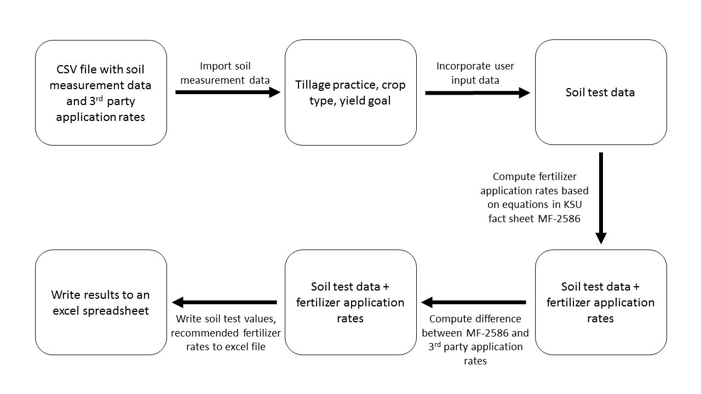

# KSU fertility calculator

__Name:__ Bryan Rutter  
__Semester:__ Spring 2020  
__Project Area:__ Soil Fertility/Agronomy  

## Objective:

Create function(s) that automate the calculation of lime and fertilizer application rates based on soil test results from the KSRE Soil Testing Laboratory.

## Rationale:

Fertilizer ammendments are often required to correct nutrient deficiencies in agricultural production systems. Over-fertilization increases the risk of eutrophication of surface water, while under-fertilization can lead to reduced crop yield, quality, and farm profitability. Fertilizer application rates are often based on a yield goal or in-season estimate of yield potential, but should be guided by soil tests to improve their accuracy when possible. However, these calculations may involve several variables and may be cumbersome to calculate by hand. The KSRE Soil Testing Lab provides soil testing services and fertilizer recommendations to Kansas homeowners and producers. Fertilizer recommendations are reported via PDF and excel documents which are computed and compiled by proprietary third-party software. The equations used to calculate fertilizer application rates are freely available to the public, but third party software can often be a _black box_ and may be difficult to troubleshoot. Creating a Python program to automate these calculations could serve as a useful validation and troubleshooting tool for lab workers, and improve the transparency of how application rates are determined.

## Outcomes

Input data consists of a combination of user inputs and soil measurements. Soil measurements include soil pH, buffer pH, organic matter, and plant available-P, -K, and -N, and will be imported as a csv file generated by the lab's data management system (SQL). Context parameters will be supplied by the user and include tillage practice, crop, and yield goal. Functions will be based on equations from KSU Fact Sheet MF-2586 and applied to these data. The output should be an excel file with 5 columns sampleID, lime_rate, N_rate, P2O5_rate, K2O_rate.

## Sketch

## References

Agronomy Department, Kansas State University (2015). _Soil Test Inerpretations and Fertilizer Recommendations (MF-2586). Retrieved from https://bookstore.ksre.ksu.edu/pubs/mf2586.pdf